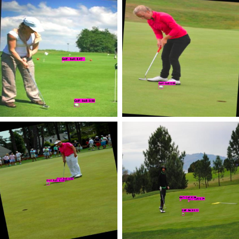

# Golf Ball Detection on a Driving Range using Computer Vision

| Student Name       | Student ID | e-mail                             |
| ------------------ | ---------- | ---------------------------------- |
| Christiaan Wiers   | 4715349    | C.W.M.Wiers@student.tudelft.nl     |
| Stijn Lafontaine   | 4908457    | S.C.Lafontaine@student.tudelft.nl  |
| Floris Krijgsman   | 4602706    | F.C.K.Krijgsman@student.tudelft.nl |


*Figure 1: a look into our project*

## Table of Contents
1. Abstract
2. Introduction
3. Method
4. Results 
5. Conclusion
6. Discussion 

## 1. Abstract
In this project, the goal is to research and apply computer vision methods to detect golf balls in a photo of a driving range. This is one of the classic problems in computer vision, namely object detection. The challenge here is that golf balls up front will be larger and more easy to detect for a computer vision algorithm whereas the golf balls more far away and thus smaller are much harder to detect for these algorithms, due to the scarcity of pixel information. The algorithm used to perform the object detection is YoloV4 [1]. This is a state-of-the art object detection algorithm proposed by Bochkovskiy et al. Four models were trained using this algorithm. These models differ in datasets and data augmentation used. The mAP scores on each of the datasets is promising, but the results on the driving ranges yield a lower performance. The lower performance is mainly due to the datasets not generalizing towards the application (detecting on the driving range).


## 2. Introduction
In this project the aim is to detect - as many as possible - golf balls an a driving range. Therefore we research what methods can be used to perform the object detection of golf balls on a driving range. Object detection consists of the localization and classification of multiple objects in the frame of interest. Lots of research has already put into this problem. Another challenge that is specific for our problem is that the objects the algorithm has to detect can be of very different size. Golf balls near the camera are large but those that are far away are then very small. This problem is due to the nature of driving ranges having golf balls at different positions relative to the camera. 

The algorithm we use in this project is YoloV4. We chose this algorithm because it's relatively fast in its prediction and training, has high performance and is easy to use thanks to a lot of community engagement around this algorithm. We also considered other algorithms: RefineDet [4], SNIP [5] and SNIPER [6]. The information to come to these options for our model came from a review of small object detection by Tong et al. [3]. RefineDet is a single shot algorithm, just like Yolo. SNIP and SNIPER are interesting alternatives since these both incorporate scale invariance. Scale invariance in object detection could be of use in our project since the objects we try to detect are occurring in different sizes in the same image. The major reason we chose Yolov4 was because that was the only feasible model to train ourselves. RefineDet, SNIP and SNIPER all required hardware and/or packages we did not have or had never worked with before. 

Apart from selecting the right model, gathering data also brings its challenges. We used the internet to gather training data to train our model golf balls. Two datasets were found, **OpenImagesV6** and **Roboflow Golfballs**. We decided to train on both datasets separately to find differences in quality between the datasets. Since the datasets found on the internet were quite small, data augmentation became necessary to provide the model with the data it needs. The details of this are further explained in the method section. 

At the end, results in testing and driving range performance are compared between the different models that were trained on each dataset. 


## 3. Method
In this section, the following three aspects are described: the chosen network YoloV4, datasets, data augmentation, training method, pre-processing and testing.


### 3.1 YoloV4
Starting off this project we had to choose a neural network in that performs object detection that would be most suitable for detecting golf balls on a driving range. During starting phase of this project we have examined the following options for our network: our own implementation of an object region proposal network along with a ResNet-50, RefineDet [4], SNIP [5], SNIPER [6] and YoloV4 [1]. Implementing our own network would not be feasible in our time span. RefineDet, SNIP and SNIPER did either not have code that could be executed by us due to hardware constraints or did not include the necessary documentation to train a model. This was quite disappointing since SNIP and SNIPER seemed very promising due to their scale invariance. This left us with the YoloV4 algorithm. This network had good documentation on how to train a model and community support. Below some more details on this:

*1. Easy Google Colab Integration*
Training a network as a student is often a challenge since oftentimes you have limited computational power at your disposal. This is where Google Colab comes in handy since they allow users to make use of their GPU's for free (albeit for a limited continuous time of several hours per run of your training). When selecting a network for this project, an easy to integrate network was preferred by us.

*2. A lot of community support/engagement*
When using neural networks there are a lot of factors that may form timing consuming challenges, examples include:
* The network being build using different -possible more unfamiliar - programming languages such as Caffe or C++.
* Limited reproduction possibilities or explanation on how to train the network, save the weights or what format of labels to use
* Other unforeseen errors

Along with the well acknowledged paper on YoloV4, we also made use of a blog post [7] covering some details about how to train a model yourself.

#### 3.1.1 Architecture
The architecture described below is based on the paper from Bochkovskiy et al [1] and the blog post from Vivek Praharska [10]. Just like the original Yolo, YoloV4 is a one-stage detector. This means that it processes an image just once, predicting the bounding boxes and classes in one go. This makes the algorithm fast. 

YoloV4 consists of three main parts,
1. The backbone: CSPDarknet53
2. The neck: an SPP Block + PANet
3. The head: YoloV3

**The backbone:**
YoloV4 uses the darknet framework, which is a high performance framework that is written in C and CUDA. Darnknet is its backbone, more specifically CSPDarknet53. CSPDarknet53 basically performs feature extraction, using convolutions and dense connections. Dense connections are like residual connections in ResNet, but also contain a dense layer in between. This performs some feature extraction in the residual connections, only letting the most important features through. The goal of the Dense connections is the same as in the residual connections in ResNet, namely alleviating the problem of the vanishing gradient.


*Figure 2: shows the CSP architecture, Darknet53 is similar*

**The neck:**
This part consists of two main parts, an SPP Block and PANet. Spatial Pyramid Pooling (SPP) is a block of multiple pooling layers with different pool size, of which all the outputs are then concatenated together. This increases the receptive field of the rest of the network. The paper by He et al. describes SPP in more detail [12]


*Figure 3: shows the Spatial Pyramid Pooling architecture*

PANet is used to shorten the information flow from input to top features. This is achieved by the used of three different techniques: Bottom-up Path Augmentation, Adaptive Feature Pooling & Fully-Connected Fusion. These techniques are fully described in the paper by Liu et al. [11]


*Figure 4: shows the PANet architecture*

**The head:**
This part is the same as the head of the YoloV3 Network, as described in the paper of Redmon et al. [13]. It predicts the values of the bounding boxes according to below:


*Figure 5: shows the functions that are used to get the bounding box values*

**Additionals techniques:**
**Dropblock:**
Just like Dropout, only instead of dropping one feature, it drops a block of features. This is a better regulization technique than Dropout for object detection. The method is described in the paper by Ghiasi et al. [15]


*Figure 6: shows the workings of dropblock (c), dropout (b)*

**Class label smoothing:**
The class label is smoothed to prevent overfitting. This is done by making a linear combination of the class label and a uniform distributed variable. This adds noise to the label, working like a regulizer. Muller et al. [14] describe why this method works as a regulizer. 


*Figure 7: the influence of class label smoothing on multiple datasets*


### 3.2 Datasets
Two different datasets were used to train separate YoloV4 models to compare. The first dataset was taken from the **OpenImagesV6**. The second dataset was found on "universe.roboflow.com", the **Roboflow Golfballs** dataset


*Figure 8: Sample from OpenImagesV6 dataset*


*Figure 9: Sample from Roboflow Golfball dataset*

### 3.3 Data augmentation
We applied data augmentation on both datasets. 

The following techniques were used on the first dataset **OpenImagesV6**:
1. Tiling
2. Brightness increase/decrease
3. Rotate images left/right


**Tiling** is a method where the image is cut in multiple smaller images by use of a grid. The purpose of which is to improve the detection performance of the network. This method is proposed in a paper by Li et al. [9]. Li et al. state that it can be successfully applied to the localization and recognition of pesticides on leaves. The researchers show that their application is ideally suited for multi-scale object detection. We think this technique might be applicable to our case as we also try to detect very small objects on a uniform background. In the image, the impact of tiling can be seen on the accuracy of a network. The top pictures are without tiling applied as data-augmentation step, the bottom pictures with tiling technique applied. 

Below the code for the tiling of the test images (train is similar):

```python
def datapipeline(path, im_name):
  '''
  This function takes image path 
  and image names as arguments
  and divides the images into 
  blocks (tiles) and detects 
  objects in individual
  blocks (tiles). Finally, the 
  blocks are stitched 
  together and detected images
  are displayed.
  '''
  
  colors = [
      (190, 200, 68)
  ]

  obj_names = [
             "Golf-ball"
  ]
  
  # read image and make tiles each of dimensions size x size
  ext = im_name.split(".")[-1]
  im = imread(path + im_name)
  size = 5
  cv2_imshow(im)
  h, w, _ = im.shape
  h_new = ceil(h/size) * size
  w_new = ceil(w/size) * size
  scale_h = h_new/h
  scale_w = w_new/w
  resized_im = resize(im, (w_new, h_new), INTER_LINEAR)
  !rm -rf "/mydrive/yolov4_2/tiled_images/" #edit this to your own path
  !mkdir "/mydrive/yolov4_2/tiled_images/" #edit this to your own path
  tiled_images_path = "/mydrive/yolov4_2/tiled_images/" #edit this to your own path
  
  tiled_ims_list = []
  for i in range(h_new//size):
    for j in range(w_new//size):
      tiled = resized_im[i*size : (i+1)*size, j*size : (j+1)*size, :]
      tiled_im_name = tiled_images_path + im_name.split(".")[0] + "_" + str(i) + "_" + str(j) + "." + ext
      tiled_ims_list.append(tiled_im_name)
      df = DataFrame(tiled_ims_list)
      # saving the path of tiled images so as to feed it to yolo model
      df.to_csv("/mydrive/yolov4_2/tiled_images/tiled_images.txt", index = False, header = False) #edit this to your own path
      # saving tiled image
      imwrite(tiled_im_name, tiled)
```


*Figure 10: shows the application of tiling in pesticide detection*

The following techniques were used on the second dataset (Roboflow):
1. Brightness increase/decrease
2. Tiling

The **Roboflow Golfballs** dataset did not need the rotation since it contained more datapoints. 

YoloV4 itself comes with data augmentation as well. It makes use of the following techniques:
**For the classifier [1]:**
1. CutMix
2. Mosaic data augmentation


*Figure 11: CutMix data augmentation example proposed by Yun et al. [8]*


*Figure 12: Mosaic data augmentation example proposed by Bochkovskiy et al. [1]*

**For the region proposal network [1]:**
1. Self-Adversarial Training
2. Mosaic data augmentation
3. Random data shapes (Resizing inputs before passing through network)


**Self-Adversarial Training** is a form of data augmentation where the forward pass of the network is used to augment the input image. Instead of one forward pass and one backward pass it performs the forward pass twice. First on the input image, then it alters the input image to create the deception that there is no object in the input image. Then it performs forwards pass on that augmented image and then regular backward pass.

Filter out the golf balls with small bounding boxes from the original training dataset and tiling those images (cutting those image up into small smaller images). The ideas behind this is that training on only those tiled and thus very small images will increase the networks' ability to detect the small golf balls located at long distances on the driving range since those are small as well.

### 3.4 Training Method
To train the YoloV4 network, Google Colab is used. Both the **OpenImagesV6** and **Roboflow GolfBall** datasets are trained with and without tiling to be able to compare. Our goal was to train every method until a loss of 0.55. We put a cap on 2000 iterations to keep the comparison reasonable.

| Dataset        | Data Augmentation | images | avg Loss |   mAp(%)  |
| ---------------| ----------------- | ------ | -------- | --------- |
| OpenImagesV6   | None              | 456    |   0.55   |    88%    |             
| OpenImagesV6   | Tiling            | 1129   |   0.49   |   62.9    |
| golfBall Image | None              | 7000   |   0.38   |    87%    |    82       
| golfBall Image | Tiling            | 3918   |   0.64   |   69.5    |     

The tiling generates of course more images than the original dataset. For the **OpenImagesV6** dataset we removed quite some data as this was not suited for tiling because these were close up images of golfballs. Therefore, a little bit more than double the data is generated. The **Roboflow Golfballs** dataset is quite a large dataset. Sadly, Google Colab and Google Drive could not handle the large dataset so we had to make it smaller to be able to train. In the picture below, an example of an image is shown where tiles are taken out of. Most of the times the tiling algorithm takes 2-3 tiles out of an image. For tiling the training data, check our  to use it on your data. Further, there is a  that will remove the pictures that are not suited for training.


*Figure 13: example of a tiled image*

### 3.5 Pre-processing Test Images
Additionally we have tried pre-processing test images with the goal of improving the test results. In order to do this, multiple image adjustment features where tried using openCV. The final image adjustment features which visually delivered promising results where: 
1) Applying a sharpness kernel
```python
sharpening_filter = np.array([[0,-1,0],
                              [-1,5,-1],
                              [0,-1,0]])
sharpened_image = cv2.filter2D(image,-1,sharpening_filter)
cv2_imshow(sharpened_image)
```
2) Filtering and justing pixel based on their brightness level
```python
ret, thresh = cv2.threshold(image, 105, 255, cv2.THRESH_TOZERO)
cv2_imshow(thresh)
```
The final results can be seen in section 4.2 "Pre-processing Test Images results". Also the Google Colab script made and used is named "openCV_pre_processing.ipynb" and can be found on the files section of this GitHub page.

## 4 Experiments and Results
Various experiments and results have been performed and obtained. For each model, results on both the test set of the model and the driving range are shown, along with the probalities of the predictions.

### 4.1 Results on OpenImagesV6 test images


*Figure 14: Shows the YoloV4 detection results on 4 randomly chosen images from the test set*

Testing the 4 random images from the original testset (figure 6) gave varying but for the most part successful results with golf balls being detected and having probabilities north of 67%. It also stands out that the images on the top-left of figure 6 shows high confidences on the most nearby golf ball location but does not detect the second golf ball also on the buttom-right image only shows 2 out 3 golf balls. The hypothesis for this is the loss which is only 0.55 and thus could become even lower when more training is performed and that way possibly solving this troubling result.

#### Tiling
The pipeline for testing images using tiling is as follows:
1. Images are cut up into tiles
2. The detector tries to detect a golfball in every tile
3. The image is put back together

The figure below shows the result on the tiled testset:



*Figure 15: results on the tiled OpenImagesV6 set*

driving_range_tiled_open_images.png

Below the results on the driving range can be seen:


*Figure 16: result on the driving range image*

### 4.2 Pre-processing Test Images results


*Figure 17: Shows from top to buttom the detection results using YoloV4 on a non pre-processed test image, a test image in which the pixels below a brightness below 105 are set to zero and a sharpness enhanced test image repsectively*


It can been seen that testing the normal image showed a total of 5 detected golf balls with varying probabilities (figure 5). Testing on the sharpness enhanced image actually resulted in a total of 6 golf balls being detected and testing on the brightness of pixels below a value of 105 reduced to zero actually delivered a total number of just 2 golf balls being detected. 
The sharpness enhancement using a kernel in openCV thus looks promosing at first sight but when taking a closer look at the pre-processed images in figure 5, you'll see probabilities of the 6 detections contained some golf balls with higher and some with lower probabilties compared to the original image. Afterwards the image adjustment features where tried on more images but this time there was no improvement to be seen compared to the original image.

For the reason we concluded that pre-processing the test image using a sharpness enhancing kernel or a feature for setting the pixels below a brightness below 105 to zero, is not a valid way of improving the amount of golf balls detected in our project.

### 4.3 Roboflow Golballs results
The figure below shows the results on the test set of this dataset. As can be seen it produces high confidence for the golballs it detects, although it also detects a golfball twice.


*Figure 18: results on the test set*

Below the results on the driving range can be seen.


*Figure 19: results on the driving range*

Although this model performs well on the test set, it performs not so well on the driving range. This can be due to multiple reasons. The first being the fact that most data in the **Roboflow Golfballs** dataset consists of images that just contain one golfball per image. Secondly, the **Roboflow Golfballs** dataset is made of samples from streaming data from golball videos. This makes the quality of the images different than that of the driving range, which can have a negative effect as well. Lastly the annotations in the **Roboflow dataset** were not of great quality. Some bounding boxes were not annotated precisely around the golfball, making it difficult for the model to learn how it should place its bounding boxes.

Total Detection Time: 463 Seconds

#### Tiling
The pipeline for testing images using tiling is as follows:
1. Images are cut up into tiles
2. The detector tries to detect a golfball in every tile
3. The image is put back together

The figure below shows the result on the tiled testset


*Figure 20: results on the tiled Roboflow Golfballs set*

Results on the driving range are not shown since the detector was not able to detect any golfballs.


## 5. Conclusion
In summary, we trained and evaluated four different YoloV4 models. Two models for each datasets (“OpenImagesV6” & “Roboflow’s GolfBalls”). Both datasets were augmented to enlarge them. The first model of each dataset was trained on the images as a whole, the second model was trained on tiled images. There were differences between the two datasets, especially on the generalization side. The OpenImagesV6 trained networks performed better on the driving range situation that Roboflow golfballs trained networks. The tiling method showed improved performance on individual golf balls when tested using the OpenImages dataset, especially on the Roboflow’s GolfBall dataset compared to the non-tiled models. However, the tiled models did not perform as well on the driving range. This is most likely due to weak capability of generalizations.  In conclusion, the model trained on the OpenImagesV6 dataset performed the best on both the test set of that dataset as well as the driving range.

## 6. Discussion
There are many different areas that could be changed to obtain other results. The first and most infuential would be the use of another model than YoloV4. The other models as described in the introduction could be implemented and used to obtain possible better results. YoloV4 itself is also complex. It used many different techniques to come to the state-of-the-art performances on the ImageNet and COCO datasets. However, the hyperparameters in YoloV4 are optimized towards those datasets, and not ours. We could do a hyperparameter search using Random Search or an evolutionary algorithm to find optimal hyperparameters for the datasets that we used. That brings us to the datasets used. Both datasets were different and resulted in different performances. The main difficulty was to generalize towards our "real life application", namely detecting golfballs on the driving range. A dataset consisting of solely driving ranges would be best to perform detection on, because such dataset will come as close as possible to the real life situation.

## References
1. Bochkovskiy, A., Wang, C. Y., & Liao, H. Y. M. (2020). Yolov4: Optimal speed and accuracy of object detection. arXiv preprint arXiv:2004.10934.
2. Github yolov4: https://github.com/AlexeyAB/darknet
3. Tong, K., Wu, Y., & Zhou, F. (2020). Recent advances in small object detection based on deep learning: A review. Image and Vision Computing, 97, 103910.
4. Zhang, S., Wen, L., Bian, X., Lei, Z., & Li, S. Z. (2018). Single-shot refinement neural network for object detection. In Proceedings of the IEEE conference on computer vision and pattern recognition (pp. 4203-4212).
5. Singh, B., & Davis, L. S. (2018). An analysis of scale invariance in object detection snip. In Proceedings of the IEEE conference on computer vision and pattern recognition (pp. 3578-3587).
6. Singh, B., Najibi, M., & Davis, L. S. (2018). Sniper: Efficient multi-scale training. Advances in neural information processing systems, 31
7. https://techzizou.com/train-a-custom-yolov4-detector-using-google-colab-tutorial-for-beginners/
8. Yun, S., Han, D., Oh, S. J., Chun, S., Choe, J., & Yoo, Y. (2019). Cutmix: Regularization strategy to train strong classifiers with localizable features. In Proceedings of the IEEE/CVF international conference on computer vision (pp. 6023-6032).
9. Li, R., Wang, R., Zhang, J., Xie, C., Liu, L., Wang, F., ... & Liu, W. (2019). An effective data augmentation strategy for CNN-based pest localization and recognition in the field. IEEE Access, 7, 160274-160283.
10. Blog post Vivek Praharska https://iq.opengenus.org/yolov4-model-architecture/
11. 11. Liu, S., Qi, L., Qin, H., Shi, J., & Jia, J. (2018). Path aggregation network for instance segmentation. In Proceedings of the IEEE conference on computer vision and pattern recognition (pp. 8759-8768).
12. He, K., Zhang, X., Ren, S., & Sun, J. (2015). Spatial pyramid pooling in deep convolutional networks for visual recognition. IEEE transactions on pattern analysis and machine intelligence, 37(9), 1904-1916.
13. Redmon, J., & Farhadi, A. (2018). Yolov3: An incremental improvement. arXiv preprint arXiv:1804.02767.
14. Müller, R., Kornblith, S., & Hinton, G. E. (2019). When does label smoothing help?. Advances in neural information processing systems, 32.
15. Ghiasi, G., Lin, T. Y., & Le, Q. V. (2018). Dropblock: A regularization method for convolutional networks. Advances in neural information processing systems, 31.
